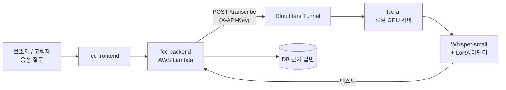

# fcc-ai - Family Care Cloud AI 서버

노인 명령어 음성 인식(STT) GPU 마이크로서비스

## 프로젝트 개요

Family Care Cloud는 가족이 함께 돌봄 기록을 남기고 다음 보호자에게 전달하는 서비스입니다.
이 저장소는 그중 **GPU가 필요한 AI 기능만** 담당합니다. 현재는 고령자 음성 명령을 텍스트로 바꾸는 음성 인식(STT)이 구현되어 있으며,
`fcc-backend`가 이 서버의 `/transcribe` API를 호출해 음성 질의 기능(`/groups/{g}/assistant/voice`)에 사용합니다.

- 프론트/백엔드는 별도 저장소에서 운영되며, 이 서버는 GPU가 있는 로컬 환경에서 단독으로 실행합니다.
- Care Handoff 요약 등 LLM 기반 기능은 GPU가 필수가 아니므로 이 저장소 범위에서 제외했습니다 (백엔드에서 별도 LLM API로 처리).

## 팀 정보

- **팀명**: fcc (FamilyCareCloud)
- **AI 레포 담당**: 1인 개발
- **개발 기간**: 2026년 9월 7일 ~

## 기술 스택

| 분류 | 기술 |
|------|------|
| 음성 인식 모델 | `openai/whisper-small` (244M) + LoRA 어댑터 |
| 파인튜닝 | transformers, PEFT (LoRA r=16), PyTorch (cu128) |
| 학습 데이터 | AI Hub "명령어 음성(노인남녀)" |
| AI 서비스 | FastAPI, uvicorn |
| 오디오 처리 | librosa, soundfile |
| 외부 노출 | Cloudflare Tunnel + `X-API-Key` 인증 |

## 레포지토리 구조

```
fcc-ai/
├── README.md
├── requirements.txt
├── .env.example                   # 환경 변수 예시
├── .gitignore
│
├── app/
│   ├── main.py                    # FastAPI 진입점 (/health, /transcribe, API 키 검증)
│   ├── config.py                  # 환경 설정 (FCC_AI_* 환경 변수)
│   └── stt.py                     # Whisper + LoRA 로딩 및 추론 (GPU/CPU 자동 선택)
│
└── models/                        # gitignore 처리 - 로컬에 직접 배치
    └── whisper-senior-lora/       # 파인튜닝된 LoRA 어댑터
```

## 시스템 구조



1. 백엔드의 `/groups/{g}/assistant/voice`가 base64 오디오를 받아 이 서버의 `/transcribe`로 전달합니다.
2. 이 서버는 오디오를 16kHz mono로 변환하고 Whisper 특징을 추출해 LoRA가 적용된 모델로 디코딩합니다.
3. 전사된 텍스트를 백엔드에 돌려주면, 백엔드가 텍스트 질문과 동일하게 DB 기반 답변을 만듭니다.

### 추론 처리 흐름 (`app/stt.py`)

| 단계 | 내용 |
|---|---|
| 서버 시작 | lifespan에서 프로세서·베이스 모델·LoRA 어댑터를 한 번만 로드하고 `eval()` 모드로 유지 (요청마다 재로딩하지 않음) |
| 디바이스 선택 | `FCC_AI_DEVICE=cuda`여도 CUDA를 쓸 수 없으면 자동으로 CPU 사용 |
| 오디오 디코딩 | 업로드된 바이트를 `librosa.load(sr=16000, mono=True)`로 읽어 형식·샘플레이트에 관계없이 통일 |
| 디코딩 옵션 | `language=korean`, `task=transcribe` 고정 (번역·언어 감지로 인한 오인식 방지) |
| 추론 | `torch.no_grad()`로 `generate()` 후 특수 토큰을 제거하고 앞뒤 공백 정리 |

## AI 서비스 API

| 엔드포인트 | 설명 | 인증 | 상태 |
|---|---|---|---|
| `GET /health` | 서버 및 device(cuda/cpu) 상태 확인 | 불필요 | 구현 완료 |
| `POST /transcribe` | 오디오 파일 → 한국어 텍스트 | `X-API-Key` (설정 시) | 구현 완료 |

### POST /transcribe

`multipart/form-data`로 오디오 파일을 `file` 필드에 담아 보냅니다. 서버가 16kHz mono로 변환해 추론합니다.

```bash
curl -X POST http://localhost:8000/transcribe \
  -F "file=@sample.wav" \
  -H "X-API-Key: $FCC_AI_API_KEY"
```

**Response Body**

```json
{ "text": "알람 그만 울려 줘." }
```

| 상태 코드 | 의미 |
|---|---|
| 200 | 성공 |
| 400 | 빈 파일 |
| 401 | `X-API-Key` 불일치 (`FCC_AI_API_KEY`가 설정된 경우) |
| 500 | 음성 인식 실패 |

지원 형식: wav, flac, ogg, webm 등 (librosa가 읽을 수 있는 형식). 그 외 content-type은 경고만 남기고 처리합니다.

### GET /health

```json
{ "status": "ok", "device": "cuda" }
```

---

## 모델 학습 결과

### 학습 데이터

| 항목 | 값 |
|---|---|
| 원본 | AI Hub "명령어 음성(노인남녀)" — AI비서 / AI로봇 / 키오스크 / 비정형 각 4,000건, 총 16,000건 |
| 무음·손상 파일 제거 | 184건 제거 (RMS 임계값 0.0005) → 15,816건 |
| **최종 학습 데이터** | **11,996건** (비정형 카테고리 제외) |
| Train / Eval | 약 10,796 / 1,200건 (9:1) |

비정형(자유 발화) 카테고리는 다른 카테고리(WER 12~13%)보다 오류율이 훨씬 높았고(약 68%),
일부 구간에서 무음·손상 파일이 집중되어 있어 최종 모델에서는 제외했습니다.

### 학습 설정

| 항목 | 값 |
|---|---|
| 베이스 모델 | `openai/whisper-small` |
| LoRA | r=16, alpha=32, dropout=0.05, target: `q_proj`, `v_proj` |
| Epoch / Batch | 5 epoch, batch 8 × gradient accumulation 2 (effective 16) |
| Learning rate | 1e-4 (linear scheduler), fp16 |
| 학습 환경 | NVIDIA RTX 5070 Ti (16GB), PyTorch 2.11.0+cu128, PEFT 0.19.1 |

### 성능 (WER, 낮을수록 좋음)

| 모델 | WER |
|---|---|
| 파인튜닝 전 (base whisper-small, zero-shot) | 49.30% |
| **파인튜닝 후 (최종, 5 epoch)** | **14.54%** |

Epoch별 검증 WER: 20.86% → 17.23% → 15.40% → 14.71% → **14.54%**

> 참고: 파인튜닝 전 수치는 별도 400건 평가셋 기준이고, 파인튜닝 후 수치는 학습에 사용하지 않은 검증셋(약 1,200건, 비정형 제외) 기준입니다.
> 평가셋 구성이 완전히 같지 않으므로 절대 비교보다는 개선 경향으로 참고해 주세요.

### 실험 이력 (모델 버전별 비교)

| 버전 | 변경 내용 | 결과 |
|---|---|---|
| base | 파인튜닝 없음 | WER 49.30% |
| v1 | 카테고리당 1,000건(총 4,000건) LoRA r=16 | WER 24.06% |
| v2 | 데이터 16,000건으로 확대 | WER 26~27% (v1보다 악화) |
| v3 | LoRA rank 32로 상향 | WER 26~27% (개선 없음) |
| v4 | 무음·손상 파일 184건 제거 | WER 26~27% (개선 미미) |
| **v5** | **비정형 카테고리 전체 제외 (11,996건)** | **WER 14.54%** |

> v2~v4는 세부 수치를 별도 표로 남기지 않았고 범위로만 기록했습니다. 아래 원인 분석을 참고하세요.

### 원인 분석 - 데이터를 늘렸는데 왜 나빠졌나

WER을 카테고리·데이터 구간별로 쪼개 분석했습니다.

- 카테고리별 WER은 AI비서·AI로봇·키오스크가 약 12~13%인 반면, **비정형(자유 발화)은 약 68%**로 전체 평균을 크게 끌어올렸습니다.
- 비정형 카테고리는 카테고리별 1,000번째 이후 구간에서 무음·손상 파일이 약 6%(3,000건 중 180건) 집중되어 있었습니다. v1은 앞쪽 1,000건만 써서 이 문제를 겪지 않았고, v2 이후 데이터를 늘리면서 문제 구간이 포함됐습니다.
- LoRA rank를 16 → 32로 올려도 개선되지 않았습니다. 이 규모의 데이터에서는 r=16으로 충분했고, 오히려 과적합 가능성이 있었습니다.
- 무음 파일만 제거(v4)해서는 부족했고, 비정형 카테고리 자체의 난이도가 높아 **제외(v5)한 것이 가장 효과적**이었습니다.

따라서 현재 모델은 **정형 명령어(AI비서·AI로봇·키오스크 유형)에 최적화**되어 있고, 자유로운 문장 발화에는 성능이 낮을 수 있습니다.

### 추론 속도 (샘플 1건, 약 2.4초 오디오)

| 환경 | 추론 시간 |
|---|---|
| GPU (RTX 5070 Ti) | 약 0.13초 |
| CPU | 약 1.1초 |

GPU가 없으면 자동으로 CPU로 대체됩니다. 학습에는 GPU가 사실상 필수이지만, 추론은 CPU로도 실사용이 가능합니다.

---

## 실행 방법

### 1. 의존성 설치

```bash
python -m venv .venv
.venv\Scripts\activate
pip install -r requirements.txt
```

GPU가 Blackwell(RTX 50 시리즈) 등 최신 세대라면 PyTorch를 cu128 빌드로 별도 설치해야 합니다:

```bash
pip install --upgrade torch --index-url https://download.pytorch.org/whl/cu128
```

### 2. 모델 배치

`models/whisper-senior-lora/` 폴더에 파인튜닝된 LoRA 어댑터 파일(`adapter_config.json`, `adapter_model.safetensors`, `tokenizer.json` 등)을 넣습니다.
용량 문제로 git에는 포함하지 않으며(.gitignore 처리됨), 담당자에게 직접 전달받아 배치합니다.

### 3. 서버 실행

```bash
cp .env.example .env
uvicorn app.main:app --host 0.0.0.0 --port 8000
```

### 환경 변수

| 변수 | 기본값 | 설명 |
|---|---|---|
| `FCC_AI_BASE_MODEL` | `openai/whisper-small` | 베이스 모델 |
| `FCC_AI_ADAPTER_PATH` | `models/whisper-senior-lora` | LoRA 어댑터 경로 |
| `FCC_AI_DEVICE` | `cuda` | `cuda` 또는 `cpu` (GPU 없으면 자동 CPU) |
| `FCC_AI_LANGUAGE` / `FCC_AI_TASK` | `korean` / `transcribe` | Whisper 디코딩 옵션 |
| `FCC_AI_HOST` / `FCC_AI_PORT` | `0.0.0.0` / `8000` | 서버 주소 |
| `FCC_AI_API_KEY` | (비어 있음) | 설정 시 `/transcribe`에 `X-API-Key` 헤더 필수 |

## 배포된 백엔드(AWS Lambda)와 연결하기

이 서버는 GPU가 필요해 로컬에서만 실행합니다. AWS의 fcc-backend가 호출하려면 공인 HTTPS 주소로 터널링해야 합니다.
**`FCC_AI_API_KEY`를 반드시 설정**하세요 — 그렇지 않으면 터널 주소를 아는 누구나 이 GPU를 호출할 수 있습니다.

```bash
# .env에 FCC_AI_API_KEY=<임의의 긴 비밀 문자열> 설정 후 서버 실행
uvicorn app.main:app --host 0.0.0.0 --port 8000

# 다른 터미널에서 Cloudflare Tunnel로 공인 URL 발급 (설치: winget install --id Cloudflare.cloudflared)
cloudflared tunnel --url http://localhost:8000
```

출력된 `https://xxxx.trycloudflare.com` 형태의 URL을 fcc-backend 저장소의 GitHub 저장소 변수/시크릿에 등록하면(Settings → Secrets and variables → Actions) 다음 배포부터 반영됩니다:

- Variables: `STT_SERVICE_URL` = 위 터널 URL
- Secrets: `STT_SERVICE_API_KEY` = 위에서 설정한 `FCC_AI_API_KEY`와 동일한 값

Quick Tunnel은 서버를 재시작할 때마다 URL이 바뀝니다. 고정 주소가 필요하면 Cloudflare 계정에 도메인을 연결한 Named Tunnel을 사용하세요.

## 학습 재현 방법

학습 스크립트는 이 저장소에 포함하지 않았고, 아래 3단계 파이프라인으로 진행했습니다.

1. **데이터 추출·점검**: AI Hub 압축 해제 후 오디오/라벨 JSON 구조 확인
2. **manifest 생성**: 오디오 경로와 정답 텍스트(`LabelText`)를 `manifest.csv`(`audio_path,text`)로 정리. 무음 파일은 RMS 0.0005 미만 기준으로 제외
3. **LoRA 파인튜닝**: `--manifest`, `--output_dir`, `--epochs`, `--lora_r` 인자로 실행, 에폭마다 검증 WER 기록

| 항목 | 값 |
|---|---|
| 검증 분할 | `train_test_split(test_size=0.1, seed=42)` |
| 저장 | 에폭마다 체크포인트 저장 (최종 어댑터는 약 7MB) |
| 지표 | WER (에폭마다 검증셋에서 계산) |

## 문제 해결 (Troubleshooting)

| 증상 | 원인 | 해결 |
|---|---|---|
| RTX 50 시리즈에서 `sm_120` 미지원 경고/오류 | 기본 PyTorch(cu124)가 Blackwell 미지원 | `torch`를 cu128 빌드로 설치 |
| 시작 시 모델 파일을 찾을 수 없음 | `models/whisper-senior-lora/`가 git에 없음 | 어댑터 파일을 해당 경로에 직접 배치 |
| `/transcribe`가 401 반환 | `FCC_AI_API_KEY` 설정 후 헤더 누락/불일치 | 요청에 `X-API-Key` 헤더를 동일한 값으로 전달 |
| GPU가 있는데 `device: cpu` | CUDA 드라이버/PyTorch 빌드 불일치 | `python -c "import torch; print(torch.cuda.is_available())"`로 확인 후 재설치 |
| 터널 URL이 바뀜 | Quick Tunnel은 재시작마다 주소 변경 | Named Tunnel 사용 또는 백엔드 변수 갱신 |
| 첫 요청이 느림 | 첫 추론 시 CUDA 초기화 | 서버 시작 후 `/health`와 샘플 요청으로 워밍업 |

## 한계와 향후 과제

- **적용 범위**: 짧은 명령어 위주로 학습되어 긴 대화나 자유 발화(비정형)는 정확도가 낮습니다.
- **평가 한계**: 파인튜닝 전/후 평가셋 구성이 달라 정확한 동일 조건 비교가 아닙니다. 고정된 공용 평가셋을 만들어 재측정할 계획입니다.
- **동시 처리**: 단일 프로세스·단일 모델 인스턴스라 동시 요청이 많으면 순차 처리됩니다.
- **가용성**: 로컬 PC에서 실행하므로 PC가 꺼지면 음성 질의는 503/502로 응답합니다(텍스트 질의는 영향 없음).
- **향후**: 정확도 개선을 위한 비정형 데이터 재정제, whisper-medium 등 큰 모델 비교, 배치 추론과 상시 서버 배포를 검토할 수 있습니다.

## 관련 저장소

- 프론트: https://github.com/FamilyCareCloud/fcc-frontend
- 백엔드: https://github.com/FamilyCareCloud/fcc-backend
- AI: https://github.com/FamilyCareCloud/fcc-ai

## 협업

main은 확인된 결과, develop은 개발 통합 브랜치입니다. develop에서 작업 브랜치를 만들고 PR로 변경을 검토합니다. 요청·응답 형식과 환경 설정은 관련 담당자와 먼저 맞춥니다.
